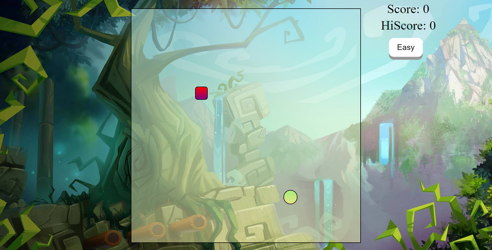

# SnakeTale-Game

## Overview
SnakeTale is a classic snake game developed using HTML, CSS, and JavaScript. In this game, players control a snake to eat food, which makes the snake grow longer. The objective is to score as many points as possible without running into the walls or the snake's own body. The game features two difficulty levels: Easy and Hard, and it keeps track of the player's current score as well as the highest score (Hi-Score).

## Features
- **Two Difficulty Levels**: Choose between Easy and Hard modes.
- **Real-Time Score Display**: Keep track of your current score while playing.
- **Hi-Score Tracking**: The game records the highest score achieved.

## Getting Started
### Prerequisites
To play SnakeTale, you need a web browser that supports HTML, CSS, and JavaScript.

### Running the Game
Open the `index.html` file in your preferred web browser to start playing.

## Game Mechanics
### Controls
- Use the arrow keys (Up, Down, Left, Right) to control the direction of the snake.
- The Hi-Score is updated if the current score exceeds the previous Hi-Score.

## Code Structure
- **HTML**: The structure of the game is defined in `index.html`.
- **CSS**: The styles for the game are contained in `style.css`.
- **JavaScript**: The game logic is implemented in `index.js`.

## Contact
If you have any questions or feedback, feel free to reach out at [mihirsahu36@gmail.com](mailto:mihirsahu36@gmail.com).
